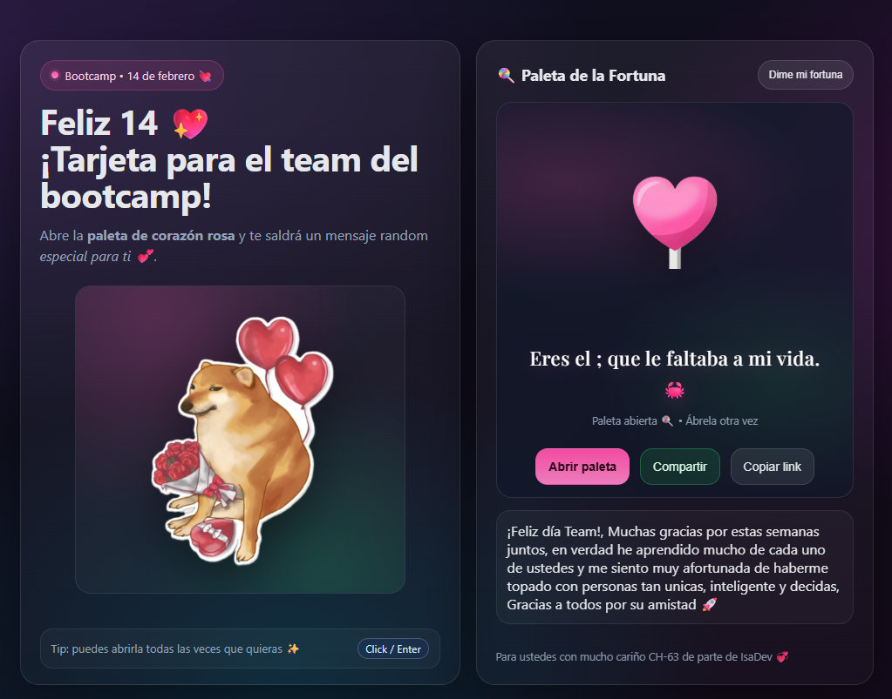

# 💖 Tarjeta 14 de Febrero — Bootcamp Edition

Una tarjeta interactiva de San Valentín con estética “neon” y vibra bootcamp: **abres la paleta** y aparece una **frase aleatoria** con **efecto de escritura**, además de un **confetti burst** que sale desde el centro de la paleta. Incluye botones para **compartir** y **copiar link**, y un **toast** de confirmación.

---

## 📸 Screenshot / Vista previa

> Captura de pantalla de la vista de la tarjeta:



---

## ✨ Features (lo que hace)

- 🍭 **Paleta interactiva**: click en la paleta o en “Abrir paleta” para revelar una frase.
- ⌨️ **Typing effect**: la frase aparece letra por letra con pausas “humanas” en signos.
- 🎉 **Confetti**: explosión de confetti desde el centro de la paleta (canvas).
- 🔁 **Frases aleatorias sin repetición inmediata**: evita mostrar la misma frase dos veces seguidas.
- 📤 **Compartir**: usa Web Share API si está disponible (móvil / navegadores compatibles).
- 🔗 **Copiar link**: copia la URL al portapapeles con fallback si falla el clipboard moderno.
- 🖼️ **Fallback de imagen**: si la imagen del doge no carga, muestra un mensaje alternativo.

---

## 🧠 Parte técnica (cómo está construido)

### Stack
- **HTML + CSS + JavaScript (Vanilla)**
- **Sin frameworks** ni dependencias externas (excepto Google Fonts).
- Animaciones y confetti usando **Canvas 2D**.

### Arquitectura del JS (conceptual)
El código está organizado por secciones para que sea fácil de mantener:

1. **Configuración**  
   Constantes y parámetros (velocidad del typing, cantidad de confetti, duración del toast, etc.)

2. **Selectores + validaciones**  
   Obtiene elementos del DOM por `id` y valida los requeridos para evitar errores silenciosos.

3. **Lógica principal**  
   - Selección de frase aleatoria sin repetición inmediata  
   - Control de estado para evitar spam de clicks mientras se escribe (`isRevealingPhrase`)

4. **Helpers**  
   - `typeText()` para escribir letra por letra  
   - `sleep()` para timing  
   - `showToast()` para feedback visual  
   - Funciones de copiar/compartir con manejo de errores

5. **Eventos**  
   Listeners centralizados para paleta y botones.

6. **Confetti Engine**  
   Motor encapsulado en función (canvas + requestAnimationFrame) que:
   - Calcula el origen desde `getBoundingClientRect()` del botón paleta
   - Controla partículas, física simple y limpieza del canvas

### Detalles importantes
- El confetti **no bloquea clicks** porque el canvas usa `pointer-events: none`.
- El typing effect agrega un cursor parpadeante con CSS (`.typing::after`).
- El fallback de copy usa `navigator.clipboard` y, si falla, un `textarea` temporal.

---

## 📁 Estructura sugerida del proyecto

```plaintext
/ (root)
├─ index.html
├─ styles.css
├─ script.js
└─ assets/
   ├─ doge01.png
   ├─ paletaRosa.png
   └─ vistaTarjeta.png
